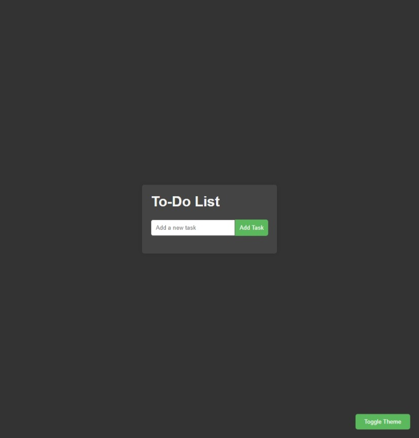

# To-Do List Application

Добро пожаловать в приложение To-Do List! Это простое и удобное приложение для управления вашими задачами, которое включает в себя несколько полезных функций, таких как добавление, удаление и отметка задач как выполненных, а также переключение между светлой и темной темами.

## Основные функции

- **Добавление задач:** Легко добавляйте новые задачи в список, используя удобную форму ввода.
- **Удаление задач:** Удаляйте задачи одним нажатием кнопки, чтобы поддерживать ваш список актуальным.
- **Отметка задач как выполненных:** Отмечайте задачи как выполненные, просто кликнув на них. Выполненные задачи будут визуально отличаться.
- **Переключение тем:** Переключайтесь между светлой и темной темами, чтобы выбрать наиболее комфортную для вас.
- **Сохранение предпочтений темы:** Ваши предпочтения темы сохраняются в `localStorage`, чтобы они сохранялись при перезагрузке страницы.

## Скриншоты


*Светлая тема*


*Темная тема*

## Установка

1. Клонируйте репозиторий:
   ```bash
   git clone https://github.com/yourusername/todo-list.git
2. Перейдите в директорию проекта:
   ```bash
   cd todo-list
## Использование

1. Откройте index.html в вашем веб-браузере.
2. Используйте форму для добавления новых задач.
3. Кликните на задачу, чтобы отметить её как выполненную.
4. Нажмите кнопку "Delete" рядом с задачей, чтобы удалить её.
5. Используйте кнопку "Toggle Theme" в нижнем правом углу для переключения между светлой и темной темами.

## Структура проекта

/css
  style.css       # Стили для приложения
/js
  script.js       # JavaScript функциональность для приложения
index.html        # Основной HTML файл

## Вклад

Я приветствую вклад в развитие проекта! Пожалуйста, открывайте issues или отправляйте pull requests для любых улучшений или исправлений ошибок.

## Лицензия

Этот проект лицензирован по лицензии MIT.

---

© 2024 Сделал Мхитарян Тигран
